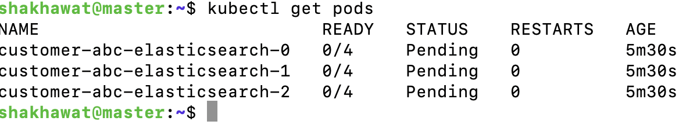
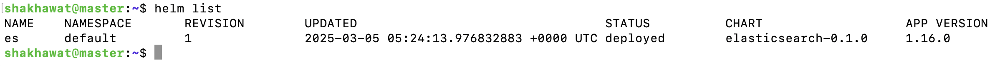
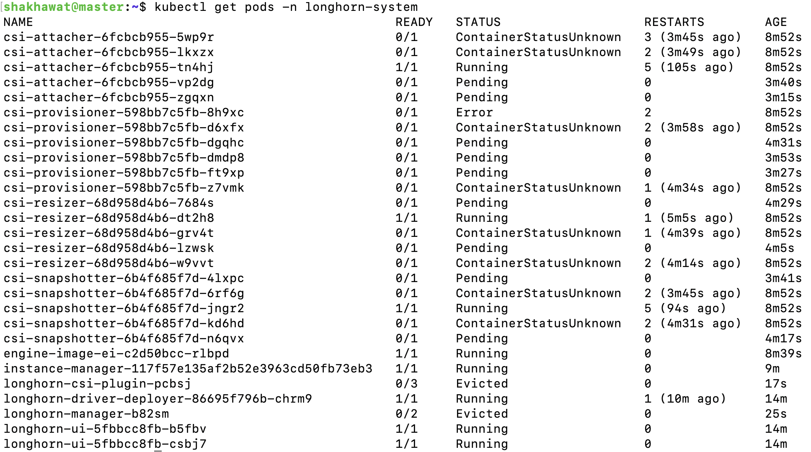

# DevOps-Project
# Configuration Management

## Environment Details
- **OS:** Ubuntu 20.04 LTS
- **Ansible Version:** 2.9.16
- **Puppet Version:** 4.5+

---

## 1. Display Ansible Configuration for a Host
To display all Ansible configuration variables for a specific host, use the following command:

```bash
ansible -m setup <hostname>
```

For example:

```bash
ansible -m setup app-vm1.fra1.internal
```

---

## 2. Configure a Cron Job to Run Logrotate Every 10 Minutes Between 2 AM - 4 AM

### **Ansible Playbook (`logrotate_cron.yml`)**

```yaml
- name: Configure logrotate cron job
  hosts: all
  become: yes
  tasks:
    - name: Ensure logrotate is installed
      apt:
        name: logrotate
        state: present

    - name: Configure cron job for logrotate
      cron:
        name: "Run logrotate every 10 minutes from 2h to 4h"
        minute: "*/10"
        hour: "2-4"
        job: "/usr/sbin/logrotate /etc/logrotate.conf"
```

### **Run the playbook:**
```bash
ansible-playbook -i inventory logrotate_cron.yml
```

---

## 3. Deploy `ntpd` Package with Custom Configuration

### **Ansible Playbook (`deploy_ntpd.yml`)**

```yaml
- name: Deploy ntpd package and configure it
  hosts:
    - app-vm1.fra1.internal
    - db-vm1.fra1.db
    - web-vm1.fra1.web
  become: yes
  tasks:
    - name: Install ntpd
      apt:
        name: ntp
        state: present

    - name: Deploy custom ntpd.conf
      copy:
        dest: /etc/ntp.conf
        content: |
          tinker panic 0
          restrict default kod nomodify notrap nopeer noquery
          restrict -6 default kod nomodify notrap nopeer noquery
          restrict 127.0.0.1
          restrict -6 ::1
          server 192.168.0.252 minpoll 4 maxpoll 8
          server 192.168.0.251 minpoll 4 maxpoll 8
          server 192.168.0.0 # local clock
          fudge 192.168.0.0 stratum 10
          driftfile /var/lib/ntp/drift
          keys /etc/ntp/keys
      notify: Restart ntpd

  handlers:
    - name: Restart ntpd
      service:
        name: ntp
        state: restarted
```

### **Run the playbook:**
```bash
ansible-playbook -i inventory deploy_ntpd.yml
```

---

## 4. Deploy a Nagios Monitoring Template

### **Nagios Configuration (`/etc/nagios/servers.cfg`)**

```cfg
define host {
  host_name app-vm1.fra1.internal
  address 192.168.0.2
  check_command check-ping
  active_checks_enabled 1
  passive_checks_enabled 1
}

define host {
  host_name db-vm1.fra1.db
  address 192.168.0.3
  check_command check-ping
  active_checks_enabled 1
  passive_checks_enabled 1
}

define host {
  host_name web-vm1.fra1.web
  address 192.168.0.4
  check_command check-ping
  active_checks_enabled 1
  passive_checks_enabled 1
}
```

### **Nagios Service Template (`/etc/nagios/services.cfg`)**
```cfg
define service {
  service_description ntp_process
  host_name app-vm1.fra1.internal, db-vm1.fra1.db, web-vm1.fra1.web
  check_command check_ntp
  check_interval 10
}
```

### **Ansible Playbook to Deploy Nagios Monitoring (`deploy_nagios_monitoring.yml`)**
```yaml
- name: Deploy Nagios monitoring templates
  hosts: monitoring.fra1.internal
  become: yes
  tasks:
    - name: Copy Nagios host configuration
      copy:
        dest: /etc/nagios/servers.cfg
        content: |
          define host {
            host_name app-vm1.fra1.internal
            address 192.168.0.2
            check_command check-ping
            active_checks_enabled 1
            passive_checks_enabled 1
          }

          define host {
            host_name db-vm1.fra1.db
            address 192.168.0.3
            check_command check-ping
            active_checks_enabled 1
            passive_checks_enabled 1
          }

          define host {
            host_name web-vm1.fra1.web
            address 192.168.0.4
            check_command check-ping
            active_checks_enabled 1
            passive_checks_enabled 1
          }

    - name: Copy Nagios service configuration
      copy:
        dest: /etc/nagios/services.cfg
        content: |
          define service {
            service_description ntp_process
            host_name app-vm1.fra1.internal, db-vm1.fra1.db, web-vm1.fra1.web
            check_command check_ntp
            check_interval 10
          }

    - name: Restart Nagios service
      service:
        name: nagios
        state: restarted
```

### **Run the playbook:**
```bash
ansible-playbook -i inventory deploy_nagios_monitoring.yml
```

# Docker/Kubernetes

## **1) Prepare a `docker-compose.yml` for an Nginx server**

### **Requirements**
- Nginx logs should persist across container restarts.
- The Docker network should use a **bridge subnet** `172.20.8.0/24`.

### **Solution - `docker-compose.yml`**
```yaml
version: '3.8'

networks:
  custom_bridge:
    driver: bridge
    ipam:
      config:
        - subnet: 172.20.8.0/24

services:
  nginx:
    image: nginx:latest
    container_name: nginx_server
    restart: always
    ports:
      - "80:80"
    volumes:
      - nginx_logs:/var/log/nginx
    networks:
      - custom_bridge

volumes:
  nginx_logs:
    driver: local
```

### **Commands to Run the Setup**
```bash
docker-compose up -d
```

---

## **2) Identify the Reason for a Pod Restart in Kubernetes**

To check why a pod in the `internal` project under the `production` namespace restarted, use:

```bash
kubectl get pod <pod-name> -n production -o jsonpath='{.status.containerStatuses[*].state}'
```

or 

```bash
kubectl describe pod <pod-name> -n production
```

- **`kubectl describe pod`** provides detailed information, including the restart count and last termination reason.


---

## **3) Possible Reasons for the Random Restarts of `java-app`**

### **Resource Quota for `java-app`**
- **Memory request & limit:** `1000Mi` (Request) & `1500Mi` (Limit)
- **CPU request & limit:** `1000m` (Request) & `2000m` (Limit)
- **JVM Xmx setting:** `1000M`

### **Pod Resource Usage**
| **Pod Name**            | **CPU (cores)** | **Memory (bytes)** |
|-------------------------|----------------|--------------------|
| `java-app`             | **3m**          | **951Mi**         |
| `java-app-logrotate`   | **1m**          | **45Mi**          |
| `java-app-fluentd`     | **1m**          | **84Mi**          |
| `mongos`               | **4m**          | **62Mi**          |

---

### ** Possible Reasons for `java-app` Restarting**
1. **Memory Limit Exceeded (`OutOfMemoryKill`)**
   - **JVM Xmx is set to 1000M**, which means Java will allocate up to **1000MiB**.
   - The pod is currently using **951MiB**, but if memory usage spikes above **1500MiB** (limit), Kubernetes will **terminate the pod (OOMKilled)**.
   - **Fix:** Increase the memory limit or reduce JVM heap size.

2. **CPU Throttling or Starvation**
   - The **CPU request is 1000m (1 core)**, but Kubernetes enforces a **2000m (2-core) limit**.
   - If `java-app` needs more CPU at runtime but **exceeds its allocated quota**, it may be **throttled or terminated**.
   - **Fix:** Monitor CPU throttling (`kubectl top pod`) and adjust the limits accordingly.

3. **Disk Pressure or Node Resource Issues**
   - If the **node** running the pod is experiencing **disk pressure or resource exhaustion**, Kubernetes **evicts** the pod and schedules it elsewhere.
   - **Fix:** Check `kubectl get events -n production`.

4. **Application-Level Issues**
   - The `java-app` itself might be **crashing** due to:
     - **Thread Deadlocks**
     - **Unhandled Exceptions**
     - **Incorrect Environment Variables**
   - **Fix:** Check `kubectl logs java-app-7d9d44ccbf-lmvbc -n production`.


---

## **Helm - Deploy Elasticsearch using Helm**

There is an issue with the _helpers.tpl file
I have deployed the chart after fixing it. The Statefulset application is deployed but the pvc is not bounding due to an issue with the longhorn pod. I can fix that but due to time limitation of this project I am unable to do it now as it will delay the submission of the project. Please see the attached screenshot

### **Screenshots**


```markdown

```

```markdown

```
```markdown

```

---

## **Metrics - Prometheus & Grafana**

### **1) How Prometheus Works**
Prometheus is an open-source monitoring system that collects metrics from configured targets at given intervals. It stores data as a **time series** and supports querying using **PromQL**. 

#### **How Prometheus Works:**
1. **Scrapes Metrics** - Prometheus pulls metrics from services via HTTP endpoints.
2. **Stores Time-Series Data** - The collected metrics are stored in a time-series database.
3. **Alerting & Rules** - It evaluates alert rules and triggers alerts when conditions are met.
4. **Visualization with Grafana** - Prometheus data can be visualized using dashboards like Grafana.

---

### **2) Creating Custom Prometheus Alerts**
To create custom alerts, you need to define **alerting rules** in Prometheus. These rules define conditions for when an alert should trigger.

#### **Example Prometheus Alert Rule for Kubernetes Monitoring**
Create a rule to alert if CPU usage exceeds 80% for more than 5 minutes:

```yaml
groups:
  - name: cpu_alerts
    rules:
      - alert: HighCPUUsage
        expr: 100 * (sum(rate(container_cpu_usage_seconds_total[5m])) by (pod)) / sum(kube_pod_container_resource_requests_cpu_cores) by (pod) > 80
        for: 5m
        labels:
          severity: critical
        annotations:
          summary: "High CPU usage detected"
          description: "Pod {{ $labels.pod }} is using more than 80% of requested CPU for over 5 minutes."
```

### **Deploying the Alert Rule**
Save the alert rule to a file (e.g., `alerts.yml`) and deploy it:

```bash
kubectl apply -f alerts.yml -n monitoring
```

---

### **3) Prometheus Query for Grafana to Show Counter Metrics Trends**
In Prometheus, **counter** metrics continuously increase over time. To get a meaningful rate of change, use the `rate()` function.

#### **Example Query to Monitor HTTP Request Rate**
```promql
rate(http_requests_total[5m])
```
This calculates the per-second rate of HTTP requests over the last **5 minutes**, smoothing out spikes.

#### **Visualizing in Grafana**
- Add a **new panel** in Grafana.
- Select **Prometheus** as the data source.
- Enter the **query**: `rate(http_requests_total[5m])`
- Set **time range** to an appropriate value (e.g., last 1 hour).
- Save and view the trend of application usage.
---
# Databases
## 1) Cassandra - Inconsistent Query Results

### Issue: Query Returns Different Results and Includes Deleted Data
Users reported that queries return different results each time and even include deleted records.

### **Likely Cause**
- **Cassandra uses an "eventually consistent" model**, meaning **deleted** data may still exist across replicas for some time.
- This is due to **Tombstones**, which are markers for deleted data but remain in the database until a **compaction** process removes them.
- If a query hits different replicas at different times, it may retrieve outdated or deleted records.

### **How to Avoid This Issue**
1. **Use `CONSISTENCY QUORUM` for Reads & Writes**
   - Instead of `CONSISTENCY ONE`, ensure that a majority of replicas confirm the read/write.
   ```sql
   SELECT * FROM table_name USING CONSISTENCY QUORUM;
   ```

2. **Manually Run Compaction to Clean Up Tombstones**
   - Compaction removes deleted records.
   ```bash
   nodetool compact keyspace_name table_name
   ```

3. **Lower `gc_grace_seconds` for Faster Tombstone Cleanup**
   - Default is **10 days**. Lower it cautiously to clean up tombstones faster.
   ```sql
   ALTER TABLE table_name WITH gc_grace_seconds = 86400; -- 1 day
   ```

4. **Use TTL (Time-to-Live) for Automatic Expiry**
   - Instead of manually deleting records, use TTL.
   ```sql
   INSERT INTO table_name (id, name) VALUES (1, 'example') USING TTL 86400;
   ```

---

## **2) MongoDB - Sharding the `company_name` Collection**

The `sanfrancisco` database in `replicaset_1` is underperforming, so we need to **shard** the `company_name` collection using `_id` across `replicaset_1` and `replicaset_2`.

### **Step-by-Step Guide to Sharding in MongoDB**

### **1) Enable Sharding in MongoDB**
Connect to the MongoDB shell and run:

```bash
mongo --host mongos
```

Enable sharding for the `sanfrancisco` database:

```js
sh.enableSharding("sanfrancisco")
```

### **2) Add `replicaset_2` to the Sharded Cluster**
Add the new replicaset to the cluster:

```js
sh.addShard("replicaset_2/mongo2:27017")
```

### **3) Shard the `company_name` Collection by `_id`**
```js
sh.shardCollection("sanfrancisco.company_name", { "_id": "hashed" })
```

- **`_id: "hashed"`** ensures an even distribution of data across shards.

### **4) Verify Sharding Status**
Check the sharded status of the collection:

```js
sh.status()
```

### **5) Migrate Existing Data to the New Shard**
Once sharding is enabled, MongoDB will automatically balance the data across the two shards.

To **manually trigger balancing**, run:

```js
db.adminCommand({ balancerStart: 1 })
```


**Author:** Md Shakhawat Hossain Rayhan, Senior DevOps Engineer
